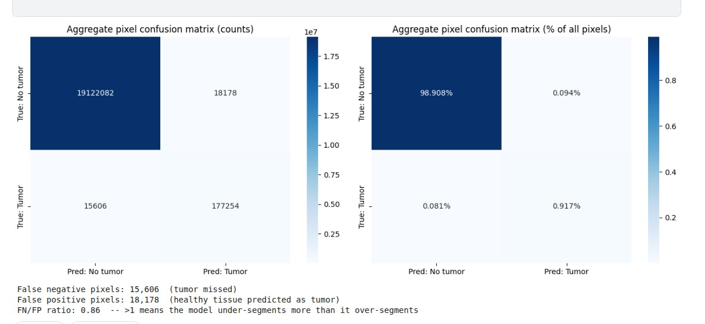

# Introduction

Brain tumor segmentation from MRI is a canonical medical image
segmentation problem: given a 2D FLAIR slice, the goal is to produce a
pixel-level binary mask indicating tumor-abnormality regions. This
project used the task as a vehicle for applying and comparing the
encoder-decoder segmentation techniques covered in the Deep Learning
Specialization -- transfer learning, U-Net-style architectures, and
loss-function design for class-imbalanced pixel-level prediction --
through a structured sequence of seventeen experiments rather than a
single model.

The project began from a publicly available reference notebook
implementing a VGG19-encoder U-Net trained with Focal Tversky loss, and
proceeded through the following phases, each motivated by the previous
phase's results:

1.  **Encoder backbone comparison** -- holding the U-Net decoder and
    loss fixed, swap the pretrained encoder (DenseNet121, ResNet34,
    EfficientNet, MobileNetV2) to isolate the effect of backbone choice.

2.  **Architecture-level changes** -- move beyond a plain U-Net decoder:
    a from-scratch residual U-Net, an Attention U-Net, DeepLabV3+, and a
    Feature Pyramid Network.

3.  **Transformer-based attempts** -- test whether global self-attention
    (Swin Transformer, and a medical-pretrained ViT via MedSAM) could
    address a small-tumor failure mode identified during error analysis.

4.  **Loss-function engineering** -- informed directly by a recurring
    diagnostic finding (systematic over-segmentation across every
    architecture), replace Focal Tversky with a weighted BCE + Dice loss
    and expand the training set to include tumor-free slices.

Every experiment shares a common evaluation protocol
(Section [3](#sec:setup){reference-type="ref" reference="sec:setup"}) so
that results are directly comparable across the whole study, and
Section [7](#sec:erroranalysis){reference-type="ref"
reference="sec:erroranalysis"} describes the diagnostic tooling built
partway through the project that ultimately motivated the final,
best-performing configuration.

# Dataset {#sec:dataset_caveat}

The LGG MRI Segmentation dataset (Buda et al., sourced from the TCGA
lower-grade glioma collection via The Cancer Imaging Archive) consists
of 110 patients and 3,929 MRI slices, each a
256$\times$`<!-- -->`{=html}256 three-channel image with a corresponding
binary FLAIR-abnormality mask. Of these, 1,373 slices contain a
non-empty tumor mask; the remaining slices are tumor-free.

Most experiments in this study (Phases 1--3) train and evaluate on the
tumor-positive subset only (1,167 train / 103 validation / 103 test
slices), following the reference notebook's protocol. The final
loss-engineering experiment
(Section [8](#sec:finalloss){reference-type="ref"
reference="sec:finalloss"}) instead trains on the full dataset,
including tumor-free slices -- a deliberate change discussed in that
section.

## A methodological caveat that applies to every result in this report {#a-methodological-caveat-that-applies-to-every-result-in-this-report .unnumbered}

The train/validation/test split used throughout most of this project is
a *random slice-level* split (`sklearn.train_test_split` with no
grouping by patient ID):

    X_train, X_val = train_test_split(brain_df_mask, test_size=0.15)
    X_test, X_val = train_test_split(X_val, test_size=0.5)

Because a single patient's scan produces many highly similar adjacent
slices, this split allows the same patient to appear in both the
training set and the test set. A direct check performed during the
transformer phase (Section [6](#sec:transformers){reference-type="ref"
reference="sec:transformers"}) confirmed this is not a hypothetical
concern: comparing patient IDs across splits found 60 overlapping
patients between train and validation, 67 between train and test, and 41
between validation and test. This means every Dice/IoU number in this
report is likely optimistically biased to some degree, since the model
can partially benefit from having seen slices from the same patient
during training. This issue was identified but not corrected before the
project's final experiments; it is the single highest-priority item in
the Future Work section (Section [11](#sec:future){reference-type="ref"
reference="sec:future"}).

# Common Experimental Setup {#sec:setup}

All CNN-based experiments (Phases 1--2 and the final loss-engineering
phase) share the same code skeleton, described here once rather than
repeated per experiment.

## Data Preprocessing and Augmentation Pipeline {#sec:preprocessing}

Every experiment in this study loads data through the same
`tf.keras.utils.Sequence` subclass, a `DataGenerator` that reads
image/mask pairs from disk and assembles them into batches on the fly.
Because this generator is shared across every CNN experiment (Phases
1--2 and 4), any behavior it encodes -- correct or not -- is inherited
by all of them, which is why it is documented here as part of the common
setup rather than per experiment.

### Loading, resizing, and per-image standardization

Each image and its corresponding mask are read from disk
(`skimage.io.imread`) and resized to 256$\times$`<!-- -->`{=html}256
with `cv2.resize`. Both are then standardized *independently, per
slice*, rather than against a single dataset-wide mean and standard
deviation:

    img = cv2.resize(img, (self.img_h, self.img_w))
    img = np.array(img, dtype=np.float64)
    ...
    img -= img.mean()
    img /= img.std()

    mask -= mask.mean()
    mask /= mask.std()
    ...
    y = (y > 0).astype(int)   # re-binarize after standardization

Per-image (rather than per-dataset) standardization is a deliberate,
reasonable choice for MRI data: FLAIR intensity ranges are not
comparable across scanners or acquisition protocols, so normalizing each
slice against its own mean and standard deviation removes a source of
purely instrumental variation before the network ever sees it, rather
than requiring the network to learn to ignore it. The mask undergoes the
same standardize-then- threshold procedure (z-score, then `y > 0`)
purely as a means of converting whatever raw pixel values the mask file
stores back into a clean $\{0,1\}$ label -- for a mask that already
contains at least one tumor pixel, this reproduces the original binary
mask exactly, since standardization preserves each pixel's ordering
relative to the mean.

**A latent bug this exposes for Phase 4.** Phases 1--3 only ever see
masks with at least one non-zero pixel (the positive-only protocol,
Section [2](#sec:dataset_caveat){reference-type="ref"
reference="sec:dataset_caveat"}), so `mask.std()` is always strictly
positive there. Phase 4's full-dataset experiments
(Sections [8.4](#sec:fulldata_unweighted){reference-type="ref"
reference="sec:fulldata_unweighted"}--[8.7](#sec:segformer){reference-type="ref"
reference="sec:segformer"}) deliberately introduce tumor-free slices,
whose mask is entirely zero. For such a slice, `mask.mean()` and
`mask.std()` are both exactly 0, so
`mask -= mask.mean(); mask /= mask.std()` is a $0/0$ division that
produces `NaN` rather than a valid all-zero label. This generator, as
written, would need an explicit guard (e.g. skip standardization
entirely for an all-zero mask, or divide by `max(mask.std(), eps)`)
before it could safely be reused verbatim for full-dataset training.
This report cannot confirm from the artifacts available whether the
actual Phase 4 training code included such a guard or normalized masks
differently at that stage; it is flagged here as a concrete, fixable
correctness risk rather than a settled fact about the Phase 4 results,
and is carried into Future Work
(Section [11](#sec:future){reference-type="ref"
reference="sec:future"}).

### Augmentation (training split only)

Augmentation is gated by an `augment` flag passed to the generator,
which is set to `True` for the training split and `False` for
validation, so that only the model's training signal is perturbed and
evaluation is always performed on unmodified data. When enabled, four
independent random transforms are attempted per image, each guarded by
its own probability check:

    if np.random.rand() < 0.2:      # horizontal flip
        img, mask = np.fliplr(img), np.fliplr(mask)
    if np.random.rand() < 0.2:      # vertical flip
        img, mask = np.flipud(img), np.flipud(mask)
    if np.random.rand() < 0:        # random rotation (+/-15 deg) -- see note below
        ...
    if np.random.rand() < 0.2:      # brightness/contrast jitter, image only
        img = img * contrast + brightness

:::: center
::: tabularx
\@l Y Y@ **Transform** & **Applied to** & **Trigger probability**\
Horizontal flip & image + mask & 0.2 (active)\
Vertical flip & image + mask & 0.2 (active)\
Rotation ($\pm15^{\circ}$) & image + mask & 0.0 -- **dead code (see
below)**\
Brightness/contrast jitter & image only & 0.2 (active)\
:::
::::

Three design choices are worth noting. First, the two flips and the
rotation are applied identically to both the image and the mask (via the
same transform call), which is the correct way to implement a geometric
augmentation for segmentation -- an image-only geometric transform would
silently misalign every augmented label. Second, the brightness/contrast
jitter is applied to the image *only*, which is also correct: intensity
jitter is a label-preserving photometric transform and must never touch
the mask. Third, and less by design: the rotation branch's condition is
`np.random.rand() < 0`. Since `np.random.rand()` draws from $[0, 1)$,
this comparison is never true, so the intended $\pm15^{\circ}$ rotation
augmentation never actually executes for any image, in any experiment,
despite being fully implemented. This is almost certainly a leftover
from disabling rotation during debugging (e.g. `< 0.2` accidentally
changed to `< 0`) rather than an intentional design decision, and is
listed as a fixable item in Future Work.

Accounting for this, the augmentation actually realized in every
experiment in this study is: independent horizontal flip, vertical flip,
and brightness/contrast jitter, each triggered independently with
probability 0.2, and no rotation. Because the three active transforms
are independent Bernoulli triggers, the probability that a given
training image receives *none* of them is $0.8^3 \approx 0.512$, so
roughly half of all training slices pass through the pipeline completely
unaugmented in any given epoch, and the other half receive one or more
of the three active transforms.

One further implementation detail affects how much of the training set
the model sees at all: `__len__` computes the number of batches as
`int(np.floor(len(self.ids)) / self.batch_size)`, which floors to a
whole number of full batches and drops the remainder. With 1,167
positive-only training slices and `batch_size=16`, this discards 15
slices ($1{,}167 - 72{\times}16$) every epoch. Because `on_epoch_end`
reshuffles the index order when `shuffle=True` (the training default), a
different 15 slices are typically dropped each epoch rather than the
same ones every time, so this is a minor loss of a couple of percent of
training signal per epoch rather than a systematic exclusion of specific
slices.

### Benefits and limits of this pipeline for the current task

Given the dataset's size -- 1,167 positive-only training slices drawn
from only 110 patients
(Section [2](#sec:dataset_caveat){reference-type="ref"
reference="sec:dataset_caveat"}) -- augmentation and per-image
normalization serve two distinct purposes here:

- **Per-image standardization** removes scanner- and
  acquisition-specific intensity scaling as a nuisance variable before
  training, which plausibly matters more for a 110-patient, multi-source
  dataset like this one than it would for data collected on a single,
  consistently calibrated scanner. This benefit applies uniformly to
  every experiment in this study, since every experiment uses the same
  generator.

- **The two active flips** are a cheap, label-preserving way to expose
  the network to roughly twice as many effective spatial arrangements of
  a given tumor without collecting more data, which is most directly
  useful for the architectures trained partly or fully from scratch on
  this small dataset (ResUNet, Section
  [5](#sec:architectures){reference-type="ref"
  reference="sec:architectures"}) but benefits every experiment that
  uses this generator.

- **Brightness/contrast jitter** discourages a model from keying on
  absolute intensity values that can vary slide-to-slide even after
  standardization, complementing the flips' spatial regularization with
  a photometric one.

- **The disabled rotation branch is a missed opportunity, not a neutral
  one.** Because tumor shape, position, and orientation carry no
  diagnostic meaning in this task (a tumor is equally valid at any
  rotation), rotation augmentation is a natural, low-risk regularizer
  for this dataset specifically, and its absence likely left some
  available regularization benefit on the table -- particularly for the
  from-scratch ResUNet and the transformer experiments
  (Section [6](#sec:transformers){reference-type="ref"
  reference="sec:transformers"}), which had the least pretrained prior
  knowledge to fall back on and would plausibly have benefited most from
  additional effective training diversity.

Overall, this pipeline is a reasonable, if only partially realized,
augmentation strategy for a small, multi-patient medical segmentation
dataset: the flips and intensity jitter that do run are well-suited to
the task's rotation- and intensity-invariance properties, but the
combination of the disabled rotation branch and the latent all-zero-mask
division risk means the pipeline's benefit to the final, best-performing
Phase 4 result
(Section [8.4](#sec:fulldata_unweighted){reference-type="ref"
reference="sec:fulldata_unweighted"}) is somewhat less than the code's
original intent, and is itself an uncontrolled variable this report
cannot fully separate from the loss and data-composition effects
discussed in Section [8](#sec:finalloss){reference-type="ref"
reference="sec:finalloss"}.

## Encoder-decoder pattern

Every U-Net variant in this study is assembled from the same two
building blocks -- a convolutional block and a decoder (upsampling)
block -- with a pretrained backbone providing the encoder skip
connections:

    def conv_block(input, num_filters):
        x = Conv2D(num_filters, 3, padding="same")(input)
        x = BatchNormalization()(x)
        x = Activation("relu")(x)
        x = Conv2D(num_filters, 3, padding="same")(x)
        x = BatchNormalization()(x)
        x = Activation("relu")(x)
        return x

    def decoder_block(input, skip_features, num_filters):
        x = Conv2DTranspose(num_filters, (2, 2), strides=2, padding="same")(input)
        x = Concatenate()([x, skip_features])
        x = conv_block(x, num_filters)
        return x

Swapping the encoder (Section [4](#sec:encoders){reference-type="ref"
reference="sec:encoders"}) is then a matter of loading a different
pretrained backbone and extracting skip-connection tensors from
different named layers, e.g. for DenseNet121:

    densenet = DenseNet121(include_top=False, weights="imagenet", input_tensor=inputs)
    s1 = densenet.get_layer("conv1_relu").output   # 128x128x64
    s2 = densenet.get_layer("pool2_relu").output   # 64x64x256
    s3 = densenet.get_layer("pool3_relu").output   # 32x32x512
    b1 = densenet.get_layer("pool4_relu").output   # 16x16x1024 (bridge)

## Loss function (Phases 1--3)

Phases 1--3 use Focal Tversky loss, which generalizes the Tversky index
(itself a generalization of Dice that allows independent weighting of
false negatives and false positives) with a focusing exponent that
down-weights easy examples:

    def tversky(y_true, y_pred):
        y_true_pos = K.flatten(y_true)
        y_pred_pos = K.flatten(y_pred)
        true_pos = K.sum(y_true_pos * y_pred_pos)
        false_neg = K.sum(y_true_pos * (1 - y_pred_pos))
        false_pos = K.sum((1 - y_true_pos) * y_pred_pos)
        alpha = 0.7
        return (true_pos + smooth) / (true_pos + alpha*false_neg + (1-alpha)*false_pos + smooth)

    def focal_tversky(y_true, y_pred):
        pt_1 = tversky(y_true, y_pred)
        gamma = 0.75
        return K.pow((1 - pt_1), gamma)

With `alpha=0.7`, false negatives are weighted more heavily than false
positives -- i.e. the loss is tuned to penalize missing tumor more than
over-predicting it. Section [7](#sec:erroranalysis){reference-type="ref"
reference="sec:erroranalysis"} shows this setting did not have the
intended effect in practice. Both `alpha` and the focusing exponent
`gamma`, along with the optimizer's learning rate, were set via a small
hyperparameter search rather than chosen arbitrarily, described next.

## Hyperparameter tuning: Tversky $\alpha$/$\gamma$ and learning rate {#sec:hypertuning}

Before running the Phase 1 encoder comparison, the two Focal Tversky
hyperparameters -- `alpha` (the weight placed on false negatives
relative to false positives in the Tversky index) and `gamma` (the
focusing exponent that down-weights already-easy pixels) -- and the Adam
optimizer's learning rate were tuned on the DenseNet121-UNet baseline.
The resulting values were then held fixed as the shared default for
every subsequent experiment in Phases 1--3, and for the Phase 4
loss-engineering variants that retained a Focal Tversky term
(Sections [8.2](#sec:boundaryloss){reference-type="ref"
reference="sec:boundaryloss"},
[8.3](#sec:segtversky){reference-type="ref" reference="sec:segtversky"},
and [8.6](#sec:tverskyfulldata){reference-type="ref"
reference="sec:tverskyfulldata"}).

:::: center
::: tabularx
0.7\@l Y@ **Hyperparameter** & **Best value found**\
Tversky `alpha` & 0.7\
Focal Tversky `gamma` & 0.75\
Optimizer learning rate & $1\times10^{-3}$\
:::
::::

These are exactly the values already shown in the `tversky` and
`focal_tversky` definitions above: the search confirmed rather than
overrode the reference notebook's original settings, so no experiment
elsewhere in this report needed to be re-run under different
hyperparameters. This tuning pass is a shared setup step rather than a
stand-alone experiment, and is not counted among the seventeen
configurations in
Table [\[tab:everything\]](#tab:everything){reference-type="ref"
reference="tab:everything"}.

The learning-rate result is also directly relevant to a failure
diagnosed later in the study: the MedSAM ViT-B experiment's Stage 2
fine-tuning (Section [6](#sec:transformers){reference-type="ref"
reference="sec:transformers"}) used a learning rate of $1\times10^{-2}$,
a full order of magnitude above the $1\times10^{-3}$ value found optimal
here, which is the most direct explanation offered for that experiment's
failure to improve past its Stage 1 result.

## Evaluation metrics

Plain pixel accuracy is not used as the headline metric, since tumor
regions typically occupy a small fraction of each slice, making accuracy
trivially high for a model that predicts nothing. Every experiment
instead reports Dice coefficient, IoU, precision, and recall, computed
per test image and averaged:

    def dice_coef(y_true, y_pred, smooth=1e-6):
        y_true_f, y_pred_f = y_true.flatten(), y_pred.flatten()
        intersection = np.sum(y_true_f * y_pred_f)
        return (2. * intersection + smooth) / (np.sum(y_true_f) + np.sum(y_pred_f) + smooth)

    def iou_coef(y_true, y_pred, smooth=1e-6):
        y_true_f, y_pred_f = y_true.flatten(), y_pred.flatten()
        intersection = np.sum(y_true_f * y_pred_f)
        union = np.sum(y_true_f) + np.sum(y_pred_f) - intersection
        return (intersection + smooth) / (union + smooth)

# Phase 1: Encoder Backbone Comparison {#sec:encoders}

Holding the decoder and Focal Tversky loss fixed, four pretrained
ImageNet encoders were substituted for the original VGG19 backbone.
Table [\[tab:encoders\]](#tab:encoders){reference-type="ref"
reference="tab:encoders"} reports test-set results.

::: tabularx
\@l Y Y Y Y@ **Encoder** & **Mean Dice** & **Mean IoU** & **Precision**
& **Recall**\
DenseNet121 & 0.858 & 0.782 & 0.835 & 0.924\
ResNet34 & 0.849 & 0.761 & 0.822 & 0.909\
EfficientNet & 0.818 & 0.725 & 0.797 & 0.884\
MobileNetV2 & 0.848 & 0.767 & 0.883 & 0.865\
:::

DenseNet121 gave the strongest result of the four and was adopted as the
encoder for all subsequent experiments in this study, including the
final loss-engineering phase. MobileNetV2 is notable for the opposite
precision/recall balance from the others (precision \> recall rather
than recall \> precision), foreshadowing the over-segmentation pattern
discussed in Section [7](#sec:erroranalysis){reference-type="ref"
reference="sec:erroranalysis"}.

# Phase 2: Architecture-Level Changes {#sec:architectures}

Phase 2 moves beyond swapping the encoder alone and changes the decoder
or overall architecture.

## ResUNet (residual blocks throughout, trained from scratch)

Unlike the encoder-swap experiments, this architecture replaces every
convolutional block -- encoder and decoder alike -- with a residual
block, and is trained entirely from scratch (no ImageNet pretraining is
available for a custom architecture):

    def residual_block(inputs, num_filters, strides=1):
        x = batchnorm_relu(inputs)
        x = Conv2D(num_filters, 3, padding="same", strides=strides)(x)
        x = batchnorm_relu(x)
        x = Conv2D(num_filters, 3, padding="same", strides=1)(x)
        s = Conv2D(num_filters, 1, padding="same", strides=strides)(inputs)  # shortcut
        s = BatchNormalization()(s)
        return Add()([x, s])

## Attention U-Net (MobileNetV2 encoder + attention gates)

Attention gates are inserted on the skip connections, letting the
decoder learn to weight relevant spatial regions of the encoder features
before concatenation:

    def attention_gate(x, g, num_filters):
        theta_x = Conv2D(num_filters, 1, padding="same")(x)   # skip features
        phi_g = Conv2D(num_filters, 1, padding="same")(g)     # decoder gating signal
        # (spatial alignment, then Add + ReLU + 1x1 Conv + sigmoid, then multiply with x)
        ...

## DeepLabV3+ (ResNet50 encoder, ASPP module)

DeepLabV3+ uses atrous (dilated) convolutions at multiple rates in an
ASPP (Atrous Spatial Pyramid Pooling) module to capture multi-scale
context without losing spatial resolution, followed by a lightweight
decoder.

## Feature Pyramid Network (EfficientNet-B0 backbone)

Built via the `segmentation_models` library rather than a hand-written
decoder:

    model = sm.FPN(
        backbone_name='efficientnetb0',
        encoder_weights=None,   # note: not ImageNet-pretrained -- see discussion below
        input_shape=(256, 256, 3),
        classes=1, activation='sigmoid'
    )

*Implementation note:* this call sets `encoder_weights=None`, meaning
the backbone was trained from random initialization despite the
accompanying code comment stating it \"leverages pre-trained
knowledge.\" This is a likely explanation for the FPN result trailing
DenseNet121 and Attention U-Net in
Table [\[tab:arch\]](#tab:arch){reference-type="ref"
reference="tab:arch"} below, and is flagged here as a concrete, fixable
bug rather than a property of the FPN architecture itself.

::: tabularx
\@l Y Y Y Y@ **Architecture** & **Mean Dice** & **Mean IoU** &
**Precision** & **Recall**\
ResUNet (from scratch) & 0.797 & 0.704 & 0.747 & 0.898\
Attention U-Net (MobileNetV2) & 0.863 & 0.782 & 0.851 & 0.901\
DeepLabV3+ (ResNet50) & 0.847 & 0.761 & 0.824 & 0.907\
FPN (EfficientNet-B0, no pretrain)& 0.820 & 0.724 & 0.787 & 0.892\
:::

Attention U-Net gave the best result in this phase, matching
DenseNet121's Dice score from Phase 1 despite using the smaller
MobileNetV2 backbone -- evidence that the attention mechanism itself,
not just backbone capacity, contributed to the result. ResUNet's weaker
result is consistent with the absence of pretrained weights: training a
full encoder-decoder from scratch on roughly 1,200 images is a
substantially harder optimization problem than fine-tuning an
ImageNet-pretrained backbone.

# Phase 3: Transformer-Based Attempts {#sec:transformers}

Motivated by the small-tumor failure mode identified in error analysis
(Section [7](#sec:erroranalysis){reference-type="ref"
reference="sec:erroranalysis"}), two experiments tested whether global
self-attention could help: a CNN receptive field is inherently local,
and a small, ambiguous tumor region may benefit from a mechanism that
relates it to the full image context.

## Swin-Tiny + U-Net decoder

A Swin Transformer (tiny variant) encoder was paired with a
convolutional U-Net-style decoder, trained in two stages (frozen
backbone, then full fine-tuning) in PyTorch. Results: mean Dice 0.821,
mean IoU 0.734, precision 0.788, recall 0.890. This is below the
DenseNet121 (Phase 1) and Attention U-Net (Phase 2) results. Two
concrete issues were identified for this run:

- The patient-leakage issue described in
  Section [2](#sec:dataset_caveat){reference-type="ref"
  reference="sec:dataset_caveat"} was directly confirmed for this
  experiment's split (60/67/41 overlapping patients across
  train/val/test), so this Dice/IoU figure is at least as affected by
  leakage as the CNN results, and likely more so given the harder
  optimization problem a transformer from a smaller-scale pretraining
  source presents.

- Input resolution was set to 224$\times$`<!-- -->`{=html}224 to match
  the Swin-Tiny pretraining recipe, discarding some detail relative to
  the 256$\times$`<!-- -->`{=html}256 resolution used by every CNN
  experiment -- a plausible secondary factor given the task's
  small-object nature.

## MedSAM ViT-B encoder + attention-gated Transformer-U-Net decoder

The second transformer attempt used MedSAM's medically-pretrained ViT-B
image encoder (rather than a prompt-based SAM-style decoder) paired with
a custom attention-gated convolutional decoder, trained in two stages: a
frozen-encoder stage (15 epochs, lr $=10^{-3}$) followed by a partial
fine-tune of the last two ViT blocks (20 epochs). This experiment did
not reach a usable result:

::: tabularx
\@l Y Y@ **Stage** & **Best val Dice** & **Learning rate**\
Stage 1 (frozen encoder) & 0.7545 (epoch 12) & $1\times10^{-3}$\
Stage 2 (last-2-blocks unfrozen) & 0.7355 (epoch 16, noisy, no clear
improvement) & $1\times10^{-2}$\
:::

The most direct explanation is a learning-rate misconfiguration: Stage
2's fine-tuning learning rate ($10^{-2}$) is set an order of magnitude
*higher* than Stage 1's ($10^{-3}$, the same value found optimal in the
hyperparameter search of
Section [3.4](#sec:hypertuning){reference-type="ref"
reference="sec:hypertuning"}), rather than lower as standard fine-tuning
practice would dictate. The resulting validation Dice curve is visibly
unstable (oscillating between roughly 0.62 and 0.75 across epochs with
no clear upward trend), consistent with a learning rate too large for
stable fine-tuning of a partially-unfrozen pretrained encoder. Test-set
evaluation was never run for this configuration, since the validation
result never surpassed Stage 1's frozen-encoder score, and the
experiment was set aside in favor of the loss-engineering direction
described next.

## Assessment of the transformer phase

Neither transformer experiment outperformed the CNN baselines in this
study. This is a genuine, useful finding rather than a dead end to omit
from the report: the underlying dataset (roughly 1,200 training images)
is small relative to what transformer architectures typically need to
realize their advantage over CNNs' built-in spatial inductive bias, and
the results here are also confounded by the leakage and configuration
issues described above. Section [11](#sec:future){reference-type="ref"
reference="sec:future"} outlines what a corrected re-attempt would
require.

# Error Analysis Methodology {#sec:erroranalysis}

Partway through the project, a recurring pattern across every
architecture in
Table [\[tab:encoders\]](#tab:encoders){reference-type="ref"
reference="tab:encoders"} and
Table [\[tab:arch\]](#tab:arch){reference-type="ref"
reference="tab:arch"} prompted a dedicated diagnostic pass: recall
consistently exceeded precision by a wide margin (e.g. DenseNet121:
precision 0.835 vs. recall 0.924), indicating the models were producing
more false positives than false negatives -- over-segmenting rather than
under-segmenting, the opposite of what `alpha=0.7` in the Focal Tversky
loss was intended to encourage.

Four diagnostics were built to investigate this and other failure
patterns, applied consistently to every subsequent experiment:

1.  **Aggregate pixel-level confusion matrix** -- true/false
    positive/negative pixel counts summed across the entire test set,
    and their ratio (FN/FP), to quantify the over- vs.
    under-segmentation balance directly rather than inferring it from
    precision/recall alone.

2.  **Score distribution histograms** -- to distinguish \"every image
    scores moderately\" from \"most images score well, a few
    catastrophic failures pull the mean down.\"

3.  **Tumor-size vs. IoU correlation** -- to test the hypothesis that
    small tumors are disproportionately hard to segment, a
    well-documented failure mode in medical image segmentation.

4.  **Train-set vs. test-set comparison** -- running the same evaluation
    on a sample of the training set to distinguish a systematic
    model/loss bias (present even on data the model was fit to) from a
    pure generalization gap (present only on unseen data).

Applied to the DenseNet121 baseline, these diagnostics found: 8.7% of
test images scored IoU $<$ 0.5; a moderate positive correlation (0.494)
between tumor area and IoU, consistent with the small-tumor failure
mode; and, most importantly, an FN/FP ratio of 0.26 on a training-set
sample (Section [7.1](#sec:trainvstest){reference-type="ref"
reference="sec:trainvstest"}) -- almost identical in character to the
test-set imbalance. Because the bias was present even on data the model
had already fit, this pointed specifically at the loss function's
weighting, not at a generalization failure, and directly motivated the
loss-engineering phase below.

## Train-set vs. test-set diagnostic {#sec:trainvstest}

::: tabularx
\@l Y Y@ **Metric** & **Train (sample)** & **Test**\
Mean Dice & 0.834 & 0.820\
Mean IoU & 0.742 & 0.719\
Mean Precision & 0.808 & 0.782\
Mean Recall & 0.906 & 0.910\
FN/FP ratio & 0.26 & --\
:::

Train and test metrics are close to each other (Dice gap of only 0.014),
which rules out simple overfitting as the primary explanation. The
training-set FN/FP ratio of 0.26 -- meaning roughly four false-positive
pixels for every false-negative pixel, even on data the model was
directly fit to -- is the clearest evidence in this study that the loss
function itself, not the architecture or the amount of data, was the
main obstacle to better precision.

# Phase 4: Loss-Function Engineering {#sec:finalloss}

Two loss-function changes were tested, both keeping the DenseNet121-UNet
architecture fixed.

## Intermediate step: Focal Tversky + BCE

The first change added a plain binary cross-entropy term to Focal
Tversky (equal-weighted average). This did not improve results (mean
Dice 0.820, mean IoU 0.719 -- see
Table [\[tab:final\]](#tab:final){reference-type="ref"
reference="tab:final"}), and the train-vs-test diagnostic above was run
specifically on this configuration, which is what identified the FN/FP
imbalance as a loss-weighting problem rather than pointing toward
further architecture changes.

## Boundary loss augmentation (Focal Tversky + distance-weighted boundary term) {#sec:boundaryloss}

Before turning to a change in training-data composition, a third
loss-engineering avenue was tried, still on the DenseNet121-UNet
architecture and the original positive-only slice protocol. Overlap
losses such as Tversky and Dice weight every misclassified pixel
identically regardless of how far it sits from the true tumor edge, so a
large blob of false-positive pixels far outside the true boundary is
penalized no more heavily than a thin sliver of false positives right at
the edge. A *boundary loss* (Kervadec et al., MIDL 2019) was added
specifically to target this: it computes a signed distance map from the
ground-truth mask (zero on the true edge, negative inside the tumor,
positive outside) and penalizes the model's predicted probability at
each pixel in proportion to that signed distance, so predictions that
stray further from the true boundary cost more. The boundary term was
combined with Focal Tversky via a scheduled weight, starting at pure
Focal Tversky (`region_weight = 1.0`) and ramping down over training so
the boundary term's influence grows as training progresses:

    # =============================================================================
    # CELL 1 -- replaces your "Define a custom loss function" cell
    #           (tversky / focal_tversky / tversky_loss are unchanged; boundary part is new)
    # =============================================================================
    # Define custom loss functions for the UNet model
    from scipy.ndimage import distance_transform_edt

    epsilon = 1e-5
    smooth = 1

    def tversky(y_true, y_pred):
        y_true = tf.cast(y_true, tf.float32)
        y_pred = tf.cast(y_pred, tf.float32)
        y_true_pos = K.flatten(y_true)
        y_pred_pos = K.flatten(y_pred)
        true_pos = K.sum(y_true_pos * y_pred_pos)
        false_neg = K.sum(y_true_pos * (1-y_pred_pos))
        false_pos = K.sum((1-y_true_pos)*y_pred_pos)
        alpha = 0.7
        return (true_pos + smooth)/(true_pos + alpha*false_neg + (1-alpha)*false_pos + smooth)

    def focal_tversky(y_true,y_pred):
        y_true = tf.cast(y_true, tf.float32)
        y_pred = tf.cast(y_pred, tf.float32)

        pt_1 = tversky(y_true, y_pred)
        gamma = 0.75
        return K.pow((1-pt_1), gamma)

    def tversky_loss(y_true, y_pred):
        return 1 - tversky(y_true,y_pred)

    # ------------------------- NEW: boundary loss --------------------------------
    # Boundary loss (Kervadec et al., MIDL 2019):  mean( phi_G * p )
    #   phi_G = signed distance to the ground-truth edge (px): 0 on the edge,
    #           negative inside the tumour, positive outside.
    #   A pixel predicted as tumour costs more the FARTHER it is from the true edge,
    #   which overlap losses (Tversky/Dice) cannot see.
    def signed_distance_batch(y):
        """(B,H,W,1) binary-ish -> (B,H,W,1) float32 signed distance map.
        Empty GT slice -> zeros (no boundary term; the Tversky term still penalises false positives)."""
        y = np.asarray(y)
        out = np.zeros(y.shape, np.float32)
        for i in range(y.shape[0]):
            m = y[i, ..., 0] > 0.5
            if not m.any():
                continue
            inside = distance_transform_edt(m)
            if (~m).any():
                out[i, ..., 0] = distance_transform_edt(~m) * (~m) - (inside - 1) * m
            else:
                out[i, ..., 0] = -(inside - 1)
        return out

    # weight on the Tversky term. Starts at 1.0 (pure Focal Tversky); AlphaScheduler ramps it down.
    region_weight = tf.Variable(1.0, trainable=False, dtype=tf.float32)

    def boundary_focal_tversky(y_true, y_pred):
        """region_weight * FocalTversky  +  (1 - region_weight) * BoundaryLoss"""
        y_true = tf.cast(y_true, tf.float32)
        y_pred = tf.cast(y_pred, tf.float32)

        phi = tf.numpy_function(signed_distance_batch, [y_true], tf.float32)
        phi = tf.stop_gradient(phi)              # constant w.r.t. the network
        phi.set_shape(y_true.shape)
        boundary = tf.reduce_mean(phi * y_pred)

        w = tf.cast(region_weight, tf.float32)
        return w * focal_tversky(y_true, y_pred) + (1.0 - w) * boundary

::: tabularx
\@l Y Y Y Y Y@ & **Dice** & **IoU** & **Pixel Acc.** & **Precision** &
**Recall**\
Mean & 0.8223 & 0.7420 & 0.9948 & 0.8267 & 0.8924\
Std & 0.2228 & 0.2302 & 0.0044 & 0.1767 & 0.2218\
:::

Mean pixel accuracy (0.9948) is reported only for completeness and is
not a useful metric here (Section [3](#sec:setup){reference-type="ref"
reference="sec:setup"}), given how few pixels in each slice are tumor.

Mean Dice (0.8223) and mean IoU (0.7420) land between the plain Focal
Tversky baseline (0.858 / 0.782) and the Focal Tversky + BCE variant
(0.820 / 0.719) -- essentially no better than simply adding a BCE term,
and still well short of the eventual full-dataset result (0.9145 /
0.8869,
Table [\[tab:fulldata_unweighted\]](#tab:fulldata_unweighted){reference-type="ref"
reference="tab:fulldata_unweighted"}). Precision and recall (0.8267 /
0.8924) remain imbalanced in the same over-segmenting direction seen
throughout this study, so making the loss boundary-aware, while
theoretically well-targeted at the over-segmentation failure mode
described in Section [7](#sec:erroranalysis){reference-type="ref"
reference="sec:erroranalysis"}, did not resolve it in practice.

## Segmentation loss + Focal Tversky (positive-only) {#sec:segtversky}

A third loss-only variant was tried, still under the original
positive-only protocol: rather than adding a plain BCE term or a
boundary term to Focal Tversky, this configuration instead adds Focal
Tversky on top of the full BCE + Dice "segmentation loss" used later for
the full-dataset experiments
(Section [8.4](#sec:fulldata_unweighted){reference-type="ref"
reference="sec:fulldata_unweighted"}), so that the model is optimized
against overlap (Dice), pixel-wise likelihood (BCE), and the
FN/FP-weighted Tversky index all at once:

    def bce_dice_tversky_loss(y_true, y_pred):
        return bce_dice_loss(y_true, y_pred) + focal_tversky(y_true, y_pred)

::: tabularx
\@l Y Y Y Y Y@ **Mean Dice** & **Mean IoU** & **Pixel Acc.** &
**Precision** & **Recall**\
& 0.7462 & 0.9944 & 0.8164 & 0.8907\
:::

Mean pixel accuracy (0.9944) is again inflated by class imbalance and
not informative here (Section [3](#sec:setup){reference-type="ref"
reference="sec:setup"}). Mean Dice (0.8396) is the best of the three
positive-only loss recombinations tried in this phase (BCE addition:
0.820; boundary loss: 0.8223; this configuration: 0.8396), suggesting
that stacking more overlap-style terms together helps marginally more
than adding a single extra term -- but it is still below the plain Focal
Tversky baseline (0.858) and far below the full-dataset result, and
precision still trails recall (0.8164 vs. 0.8907) by roughly the same
margin as every other positive-only configuration.

Taken together, none of the three loss-only avenues tried in this phase
-- reweighting FN vs. FP
(Table [\[tab:final\]](#tab:final){reference-type="ref"
reference="tab:final"}), making the loss boundary-aware
(Table [\[tab:boundaryloss\]](#tab:boundaryloss){reference-type="ref"
reference="tab:boundaryloss"}), and stacking Focal Tversky onto the full
segmentation loss
(Table [\[tab:segtversky\]](#tab:segtversky){reference-type="ref"
reference="tab:segtversky"}) -- matched what a pure change in
training-data composition achieved
(Section [8.4](#sec:fulldata_unweighted){reference-type="ref"
reference="sec:fulldata_unweighted"}), reinforcing that the bottleneck
was what the model saw during training, not how its errors were
penalized.

## Full dataset + plain BCE + Dice (unweighted) {#sec:fulldata_unweighted}

Before adding explicit false-negative weighting, a simpler change was
tested first in isolation: keep an unweighted BCE + Dice loss, and
switch training from the tumor-positive subset to the full dataset
(including tumor-free slices), the same data-coverage change described
for the final experiment below:

    def bce_dice_loss(y_true, y_pred):
        bce = tf.reduce_mean(tf.keras.losses.binary_crossentropy(y_true, y_pred))
        return bce + dice_coef_loss(y_true, y_pred)

::: tabularx
\@l Y Y Y Y@ **Configuration** & **Mean Dice** & **Mean IoU** &
**Precision** & **Recall**\
DenseNet121 + Focal Tversky + BCE (positive-only) & 0.820 & 0.719 &
0.782 & 0.910\
**DenseNet121 + BCE + Dice, full data (unweighted)** & **0.9145** &
**0.8869** & 0.9304 & **0.9440**\
:::

This single change -- full-dataset training, with no change to the
loss's error weighting at all -- produced the largest jump of any single
intervention in this study: mean Dice rose from 0.820 to 0.9145 and mean
IoU from 0.719 to 0.8869 relative to the positive-only Focal Tversky +
BCE run, and precision and recall are both above 0.93 for the first time
in the entire study. This is strong direct evidence that the dominant
obstacle identified in
Section [7](#sec:erroranalysis){reference-type="ref"
reference="sec:erroranalysis"} (over-segmentation, i.e. the model
over-predicting tumor on positive-only training data) was substantially
a consequence of *never having seen a tumor-free slice during training*,
rather than requiring a change to the loss's precision/recall weighting
at all.

    brain_df_mask = brain_df   # no longer filtered to mask == 1

The aggregate pixel-level confusion matrix on the test set for this
configuration (Figure 1)

{#fig:placeholder width="100%"}

confirms the same balanced behavior seen in the summary metrics: of
19,333,120 test-set pixels, only 15,606 tumor pixels were missed (false
negatives) and 18,178 healthy pixels were mislabeled as tumor (false
positives), giving an FN/FP ratio of 0.86 -- close to the ideal value of
1, and dramatically better balanced than any positive-only-trained
configuration in this study (which ranged from 0.26 to 0.38). A ratio
below 1 indicates the model still leans slightly toward
over-segmentation (more false positives than false negatives),
consistent with the small residual gap between its precision (0.9304)
and recall (0.9440).\

## Final configuration: Weighted BCE + Dice, full dataset

With full-dataset training already established as the main driver of the
previous result, this experiment additionally asks whether adding
explicit false-negative weighting on top of full-data training helps
further. Two changes were made together relative to the original Focal
Tversky baseline:

1.  **Explicit false-positive weighting in the loss**, trying to
    penalize the FN pixels more and limit them:

        def weighted_bce_loss(y_true, y_pred, fp_weight=1.0, fn_weight=2.0):
            y_pred = tf.clip_by_value(y_pred, epsilon, 1.0 - epsilon)
            fn_loss = y_true * tf.math.log(y_pred)
            fp_loss = (1.0 - y_true) * tf.math.log(1.0 - y_pred)
            return tf.reduce_mean(-(fn_weight * fn_loss + fp_weight * fp_loss))

        def weighted_bce_dice_loss(y_true, y_pred):
            return 0.5 * weighted_bce_loss(y_true, y_pred) + 0.5 * dice_coef_loss(y_true, y_pred)

    Note this still weights false negatives more than false positives
    (`fn_weight=2.0` vs. `fp_weight=1.0`), the same qualitative
    direction as Focal Tversky's `alpha=0.7` -- the change is in *how*
    that weighting interacts with the rest of the loss (a direct
    log-likelihood weighting rather than a Tversky-index ratio), not a
    reversal of which error type is penalized more. This exposes the
    model to examples of what a normal, tumor-free slice looks like
    during training -- something.

Table [\[tab:fulldata_fnfp_compare\]](#tab:fulldata_fnfp_compare){reference-type="ref"
reference="tab:fulldata_fnfp_compare"} compares this result directly
against the weighted BCE + Dice configuration on the same full-data test
set. The two configurations bracket the ideal FN/FP ratio of 1 from
opposite sides: the unweighted loss slightly over-segments (ratio 0.86),
while adding explicit false-negative weighting overcorrects into slight
under-segmentation (ratio 1.05) -- direct pixel-level evidence for the
claim in Section [8](#sec:finalloss){reference-type="ref"
reference="sec:finalloss"} that the added weighting was not a clear
improvement once full-dataset training was already in place.

::: tabularx
\@l Y Y@ **Metric** & **BCE + Dice (unweighted)** & **Weighted BCE +
Dice**\
False negative pixels & 15,606 & 18,912\
False positive pixels & 18,178 & 17,996\
FN/FP ratio & 0.86 (slight over-segmentation) & 1.05 (slight
under-segmentation)\
Mean Dice & **0.9145** & 0.911\
Mean IoU & **0.8869** & 0.881\
Mean Precision & 0.9304 & **0.938**\
Mean Recall & **0.9440** & 0.935\
:::

::: tabularx
\@l Y Y Y Y@ **Configuration** & **Mean Dice** & **Mean IoU** &
**Precision** & **Recall**\
DenseNet121 + Focal Tversky (baseline) & 0.858 & 0.782 & 0.835 & 0.924\
DenseNet121 + Focal Tversky + BCE & 0.820 & 0.719 & 0.782 & 0.910\
**DenseNet121 + Weighted BCE + Dice, full data** & **0.911** & **0.881**
& **0.938** & **0.935**\
:::

The weighted configuration improved every metric substantially relative
to the original DenseNet121 baseline, and reached the most balanced
precision/recall of any experiment in this study (0.938 vs. 0.935).
However, comparing it directly against
Section [8.4](#sec:fulldata_unweighted){reference-type="ref"
reference="sec:fulldata_unweighted"}'s unweighted full-data result
(Table [\[tab:fulldata_unweighted\]](#tab:fulldata_unweighted){reference-type="ref"
reference="tab:fulldata_unweighted"}) shows the added false-negative
weighting did *not* improve on the unweighted version: Dice (0.911 vs.
0.9145), IoU (0.881 vs. 0.8869), and recall (0.935 vs. 0.9440) are all
marginally *lower* with weighting added, and only precision is
marginally higher (0.938 vs. 0.930). The most likely explanation is that
full-dataset training had already resolved most of the precision/recall
imbalance on its own
(Section [8.4](#sec:fulldata_unweighted){reference-type="ref"
reference="sec:fulldata_unweighted"}), so the additional `fn_weight=2.0`
push toward recall was no longer correcting an existing deficit and
instead traded a small amount of Dice/IoU for a small precision gain.
The train-vs-test diagnostic was run again on this weighted
configuration:

::: tabularx
\@l Y Y@ **Metric** & **Train** & **Test**\
Mean Dice & 0.969 & 0.911\
Mean IoU & 0.949 & 0.881\
FN/FP ratio & 0.65 & --\
:::

Two findings temper this configuration specifically. First, the FN/FP
ratio, while much improved relative to the positive-only runs (0.26
$\to$ 0.65), is still below 1, meaning the over-segmentation tendency
was reduced rather than eliminated. Second, a train/test Dice gap of
0.058 is now present, where the earlier positive-only configuration's
gap was only 0.014 -- some of the apparent improvement over the original
baseline may reflect a better-fit but slightly less generalized model,
alongside the genuine effect of the loss and data changes. Combined with
the comparison above, this suggests the added FN-weighting was not
clearly worth its cost once full-dataset training was already in place,
and the simpler unweighted configuration
(Section [8.4](#sec:fulldata_unweighted){reference-type="ref"
reference="sec:fulldata_unweighted"}) is the more defensible choice to
carry forward. Separating how much of either result is a true
improvement versus an artifact of the (still unresolved) patient-leakage
issue remains the most important open question raised by this project,
discussed next.

## Isolating the loss family: Focal Tversky on the full dataset {#sec:tverskyfulldata}

Section [8.4](#sec:fulldata_unweighted){reference-type="ref"
reference="sec:fulldata_unweighted"} changed two things at once relative
to the positive-only baselines: the loss (Focal Tversky $\to$ BCE +
Dice) and the training data (positive-only $\to$ full dataset). To
isolate which of the two was actually responsible for the improvement,
this experiment changed only the data: the original, unmodified Focal
Tversky loss from Phases 1--3
(Section [3](#sec:setup){reference-type="ref" reference="sec:setup"})
was retrained on the full dataset, with no BCE or Dice term added.

::: tabularx
\@l Y Y Y Y Y@ **Mean Dice** & **Mean IoU** & **Pixel Acc.** &
**Precision** & **Recall**\
& 0.8707 & 0.9982 & 0.9234 & 0.9408\
:::

This single change -- full-dataset training, with the original Focal
Tversky loss left completely untouched -- raised mean Dice from 0.858 to
0.8970 and mean IoU from 0.782 to 0.8707 relative to the positive-only
Focal Tversky baseline
(Table [\[tab:encoders\]](#tab:encoders){reference-type="ref"
reference="tab:encoders"}), confirming that most of the benefit seen in
Section [8.4](#sec:fulldata_unweighted){reference-type="ref"
reference="sec:fulldata_unweighted"} really was a data effect rather
than something specific to the BCE + Dice loss: switching only the
training data, and nothing about the loss, still produced the
second-largest single improvement of any experiment in this study.

However, this result also refines rather than fully confirms the claim
that the loss function did not matter. Full-data Focal Tversky (0.8970 /
0.8707) still trails the full-data BCE + Dice result
(Table [\[tab:fulldata_unweighted\]](#tab:fulldata_unweighted){reference-type="ref"
reference="tab:fulldata_unweighted"}: 0.9145 / 0.8869) by 0.0175 Dice
and 0.0162 IoU, and precision in particular is lower (0.9234 vs. 0.9304)
than with BCE + Dice. So while training-data composition accounts for
the large majority of the improvement over the original baseline,
switching the loss family to BCE + Dice contributed a smaller, genuine
improvement on top of the data change -- the two effects point in the
same direction and are not fully separable from a single pair of runs,
but neither is sufficient on its own to explain the full-data result:
data composition explains most of it, loss family explains a smaller
remainder.

## A transformer re-attempt: SegFormer-UNet, full dataset {#sec:segformer}

Phase 3's transformer experiments
(Section [6](#sec:transformers){reference-type="ref"
reference="sec:transformers"}) were run under the original
positive-only, Focal Tversky protocol, and neither Swin-Tiny nor MedSAM
matched the CNN baselines. Given how large an effect full-dataset
training with an unweighted BCE + Dice loss had on the CNN result
(Section [8.4](#sec:fulldata_unweighted){reference-type="ref"
reference="sec:fulldata_unweighted"}), it was worth directly testing
whether a transformer encoder, given the same recipe, would close that
gap. A SegFormer encoder paired with a U-Net-style decoder (PyTorch) was
trained from scratch on the full dataset (including tumor-free slices)
with the same unweighted BCE + Dice loss used in
Section [8.4](#sec:fulldata_unweighted){reference-type="ref"
reference="sec:fulldata_unweighted"}.

::: tabularx
\@l Y Y Y Y Y@ & **Dice** & **IoU** & **Pixel Acc.** & **Precision** &
**Recall**\
Mean & 0.8855 & 0.8558 & 0.9971 & 0.9004 & 0.9501\
Std & 0.2573 & 0.2703 & 0.0054 & 0.2167 & 0.1794\
:::

Pixel accuracy is reported at 0.9971, but consistent with
Section [3](#sec:setup){reference-type="ref" reference="sec:setup"}'s
decision not to use accuracy as a headline metric, this figure is
inflated by class imbalance and is not informative here: most pixels in
most slices are background regardless of the model's tumor-segmentation
quality.

Mean Dice (0.8855) and mean IoU (0.8558) are both a clear improvement
over either transformer attempt in Phase 3 (Swin-Tiny: 0.821 / 0.734) --
direct evidence that full-dataset training is not a CNN-specific effect,
and that it helps correct a transformer's over-segmentation tendency in
the same way it helped the CNN. However, both metrics still fall short
of the DenseNet121 + BCE + Dice full-data result
(Table [\[tab:fulldata_unweighted\]](#tab:fulldata_unweighted){reference-type="ref"
reference="tab:fulldata_unweighted"}: Dice 0.9145, IoU 0.8869), and
precision is meaningfully lower (0.9004 vs. 0.9304) while recall is
marginally higher (0.9501 vs. 0.9440) -- the same recall-leaning
imbalance seen throughout the earlier transformer work, though far less
pronounced than in the original Focal-Tversky-trained versions.

One further observation: the per-image standard deviation on Dice
(0.257) is far larger than anything reported for the CNN configurations
elsewhere in this study, indicating a wide spread between near-perfect
and near-failing individual slices rather than uniformly moderate
performance -- exactly the \"few catastrophic failures pull the mean
down\" pattern the score-distribution diagnostic in
Section [7](#sec:erroranalysis){reference-type="ref"
reference="sec:erroranalysis"} was built to detect. Whether these
failures cluster on tumor-free slices, small tumors, or particular
patients was not investigated for this run and is listed in
Section [11](#sec:future){reference-type="ref" reference="sec:future"}.

# Full Results Summary

::: tabularx
\@l Y Y Y Y@ **Experiment** & **Mean Dice** & **Mean IoU** &
**Precision** & **Recall**\
\
DenseNet121-UNet & 0.858 & 0.782 & 0.835 & 0.924\
ResNet34-UNet & 0.849 & 0.761 & 0.822 & 0.909\
EfficientNet-UNet & 0.818 & 0.725 & 0.797 & 0.884\
MobileNetV2-UNet & 0.848 & 0.767 & 0.883 & 0.865\
\
ResUNet (from scratch) & 0.797 & 0.704 & 0.747 & 0.898\
Attention U-Net (MobileNetV2)& 0.863 & 0.782 & 0.851 & 0.901\
DeepLabV3+ (ResNet50) & 0.847 & 0.761 & 0.824 & 0.907\
FPN (EfficientNet-B0) & 0.820 & 0.724 & 0.787 & 0.892\
\
Swin-Tiny + U-Net decoder & 0.821 & 0.734 & 0.788 & 0.890\
MedSAM ViT-B + Transformer-U-Net &\
\
DenseNet121 + Focal Tversky + BCE (positive-only) & 0.820 & 0.719 &
0.782 & 0.910\
DenseNet121 + Focal Tversky + Boundary Loss (positive-only) & 0.8223 &
0.7420 & 0.8267 & 0.8924\
DenseNet121 + Segmentation Loss + Focal Tversky (positive-only) & 0.8396
& 0.7462 & 0.8164 & 0.8907\
**DenseNet121 + BCE + Dice, full data (unweighted)** & **0.9145** &
**0.8869** & 0.9304 & **0.9440**\
DenseNet121 + Weighted BCE + Dice, full data & 0.911 & 0.881 & **0.938**
& 0.935\
DenseNet121 + Focal Tversky, full data & 0.8970 & 0.8707 & 0.9234 &
0.9408\
SegFormer-UNet + BCE + Dice, full data & 0.8855 & 0.8558 & 0.9004 &
0.9501\
:::

# Discussion

The single clearest pattern across this study is that **data-composition
change outperformed every architecture and loss-weighting change
attempted**. Four encoder swaps and four architecture-level changes
(Phases 1--2) span a narrow range of mean Dice (0.797--0.863), and two
considerably more sophisticated transformer-based attempts (Phase 3) did
not exceed that range at all. The two experiments that produced a
qualitatively different result -- both in Phase 4 -- required no new
architecture at all: switching from the tumor-positive subset to the
full dataset was the change that mattered, and it mattered with or
without added false-negative weighting in the loss
(Table [\[tab:everything\]](#tab:everything){reference-type="ref"
reference="tab:everything"}). The unweighted version
(Section [8.4](#sec:fulldata_unweighted){reference-type="ref"
reference="sec:fulldata_unweighted"}) was in fact marginally *better*
than the weighted version on three of four metrics, indicating that once
the model sees tumor-free examples during training, the loss-weighting
correction that helped on the positive-only protocol is no longer doing
useful work. This is a useful, generalizable lesson: for this
class-imbalanced pixel-level task, *what data the model was trained on*
was a more impactful lever than either model capacity, architectural
sophistication, or loss-function reweighting.

Three loss-only avenues were tried, all under the positive-only protocol
and all falling well short of the full-dataset result: adding a plain
BCE term to Focal Tversky (mean Dice 0.820,
Table [\[tab:final\]](#tab:final){reference-type="ref"
reference="tab:final"}), adding a boundary-distance term instead (mean
Dice 0.8223, Section [8.2](#sec:boundaryloss){reference-type="ref"
reference="sec:boundaryloss"}), and stacking Focal Tversky onto the full
BCE + Dice segmentation loss (mean Dice 0.8396,
Section [8.3](#sec:segtversky){reference-type="ref"
reference="sec:segtversky"}). Each recombines the same handful of loss
terms slightly differently, and each landed within a narrow band below
the plain Focal Tversky baseline (0.858) -- no recombination of loss
terms alone, without touching the training data, closed more than a
small fraction of the gap to the full-dataset result.

Two further experiments then asked a more precise question: was the
full-dataset improvement tied specifically to the BCE + Dice loss, or to
the DenseNet121 encoder, or would it show up regardless of either?
Retraining the *original, unmodified* Focal Tversky loss on the full
dataset (Section [8.6](#sec:tverskyfulldata){reference-type="ref"
reference="sec:tverskyfulldata"}) reached a mean Dice of 0.8970 --
almost as large a jump from the Focal Tversky baseline (0.858) as
switching to BCE + Dice produced, but still 0.0175 Dice short of the
full-data BCE + Dice result (0.9145). Separately, retraining a
SegFormer-UNet transformer with the winning full-data BCE + Dice recipe
(Section [8.7](#sec:segformer){reference-type="ref"
reference="sec:segformer"}) reached 0.8855, a similarly large jump from
its own positive-only Phase 3 baseline but again short of DenseNet121's
result. Together, these two checks show that most, but not quite all, of
the full-dataset effect is independent of both the specific loss and the
specific encoder: switching only the data, with everything else held
fixed, recovered the large majority of the improvement in both cases,
while switching only the loss (to BCE + Dice) or only the encoder (to
DenseNet121) each contributed a smaller additional improvement on top.
That data-composition change is the one factor in this study that
improved results regardless of which loss or which encoder it was paired
with, even though it was not the sole explanation for the very best
result.

The error-analysis methodology
(Section [7](#sec:erroranalysis){reference-type="ref"
reference="sec:erroranalysis"}) was what made this possible -- without
the aggregate confusion matrix and the train-vs-test diagnostic
specifically, the systematic over-segmentation pattern would likely have
been attributed to \"the model needs to be bigger\" or \"try a fancier
architecture,\" which the transformer experiments show would not have
been an effective use of effort.

# Limitations and Future Work {#sec:future}

- **Patient-level data leakage (highest priority).** As detailed in
  Section [2](#sec:dataset_caveat){reference-type="ref"
  reference="sec:dataset_caveat"}, essentially every experiment in this
  report used a random slice-level split rather than a patient-grouped
  one. Repeating the final configuration (and ideally the full
  comparison table) with a `GroupShuffleSplit` keyed on patient ID,
  extracted from the standard `TCGA_<institution>__<slice>` filename
  format, is necessary before any of these numbers should be treated as
  a reliable estimate of real-world performance.

- **MedSAM learning-rate fix.** The Stage 2 fine-tuning learning rate
  ($10^{-2}$) should be corrected to a value below Stage 1's ($10^{-3}$,
  the value established in
  Section [3.4](#sec:hypertuning){reference-type="ref"
  reference="sec:hypertuning"}), e.g. $10^{-5}$, consistent with
  standard discriminative fine-tuning practice, and the experiment
  re-run before drawing final conclusions about MedSAM's suitability for
  this task.

- **FPN pretrained-weights fix.** The Feature Pyramid Network experiment
  should be re-run with `encoder_weights=’imagenet’` rather than `None`
  to give it a fair comparison against the other architectures, all of
  which benefited from ImageNet pretraining.

- **Swin-Tiny at native resolution.** Re-running the Swin-Tiny
  experiment at 256$\times$`<!-- -->`{=html}256 (matching every CNN
  experiment) rather than 224$\times$`<!-- -->`{=html}224 would remove
  one confounding variable from that comparison.

- **Guard the data generator against all-zero masks.** As detailed in
  Section [3.1](#sec:preprocessing){reference-type="ref"
  reference="sec:preprocessing"}, the shared `DataGenerator`'s mask
  standardization step divides by `mask.std()`, which is exactly 0 for a
  tumor-free slice's all-zero mask. Adding an explicit guard (skip
  standardization for an all-zero mask, or divide by
  `max(mask.std(), eps)`) before any further full-dataset experiments
  would remove this as a possible confound in the Phase 4 results.

- **Fix the disabled rotation augmentation.** The rotation branch's
  trigger condition (`np.random.rand() < 0`) never fires
  (Section [3.1](#sec:preprocessing){reference-type="ref"
  reference="sec:preprocessing"}); restoring it to a small positive
  probability (e.g. `< 0.2`, matching the other active transforms) would
  let the from-scratch and transformer architectures in particular
  benefit from a rotation-invariance regularizer that the current
  pipeline only implements but never runs.

- **Further exploit the full-data direction.** Given that full-dataset
  training outperformed both architecture changes and loss reweighting
  in this study, a natural next step is combining full-dataset training
  (with the simpler unweighted BCE + Dice loss,
  Section [8.4](#sec:fulldata_unweighted){reference-type="ref"
  reference="sec:fulldata_unweighted"}) with the best Phase 2
  architecture (Attention U-Net) rather than treating these improvements
  as alternatives.

- **Re-run the boundary loss on the full dataset.** The boundary-aware
  loss (Section [8.2](#sec:boundaryloss){reference-type="ref"
  reference="sec:boundaryloss"}) was only tested under the positive-only
  protocol, and its `region_weight` schedule (the rate at which weight
  shifts from Focal Tversky toward the boundary term) was not itself
  tuned or reported here. Since it targets a different failure signature
  (distance from the true boundary) than BCE + Dice does, combining it
  with full-dataset training rather than treating the two as competing
  fixes is a reasonable next experiment.

- **Post-processing and test-time augmentation.** Not explored in this
  study; both are inexpensive additions (morphological opening to remove
  small spurious false-positive regions; averaging predictions over
  flipped/rotated test-time copies of each input) that could plausibly
  improve the final model further without retraining.

- **Investigate SegFormer's high per-image variance.** The
  SegFormer-UNet re-attempt
  (Section [8.7](#sec:segformer){reference-type="ref"
  reference="sec:segformer"}) showed a much larger per-image standard
  deviation on Dice (0.257) than any other configuration in this study.
  Running the Section [7](#sec:erroranalysis){reference-type="ref"
  reference="sec:erroranalysis"} diagnostics (aggregate confusion
  matrix, score-distribution histogram, tumor-size correlation) on this
  run would clarify whether its failures cluster on small tumors,
  tumor-free slices, or particular patients.

- **Decompose the residual loss-family effect.**
  Section [8.6](#sec:tverskyfulldata){reference-type="ref"
  reference="sec:tverskyfulldata"} showed that, on the full dataset,
  Focal Tversky (0.8970 Dice) still trails BCE + Dice (0.9145) by a
  small margin. Since "BCE + Dice" bundles two different terms, ablating
  BCE-only and Dice-only full-data runs against this Focal Tversky
  full-data result would show which specific term is responsible for
  that remaining gap, rather than leaving it attributed to the loss
  family as a whole.

# Conclusion

This project applied a structured, iterative methodology to brain tumor
segmentation: establish a baseline, systematically vary one factor at a
time (encoder, then architecture, then a more ambitious architectural
family), diagnose failures quantitatively rather than guessing, and let
that diagnosis drive the next intervention. The resulting best model --
a DenseNet121-UNet trained with an unweighted BCE + Dice loss on the
full dataset, including tumor-free slices -- reached a mean Dice of
0.9145 and mean IoU of 0.8869, improving on the initial baseline by a
wide margin and outperforming every architecture-level change, both
transformer-based approaches, and even a more elaborately weighted
version of its own loss function. The most valuable general finding is
methodological rather than architectural: for this task, understanding
*how* a model was failing (via aggregate confusion matrices and a
train-vs-test comparison) correctly identified training-data coverage,
not model capacity or loss-weighting sophistication, as the primary
bottleneck. Three separate loss-only recombinations
(Table [\[tab:everything\]](#tab:everything){reference-type="ref"
reference="tab:everything"}) each failed to close more than a small part
of that gap, while two later checks confirmed the data effect held
across both encoder families (SegFormer,
Section [8.7](#sec:segformer){reference-type="ref"
reference="sec:segformer"}) and the original loss family (Focal Tversky,
Section [8.6](#sec:tverskyfulldata){reference-type="ref"
reference="sec:tverskyfulldata"}) -- though the latter check also showed
the attribution is not absolute: full-data Focal Tversky (0.8970 Dice)
still trailed full-data BCE + Dice (0.9145) by a small but real margin,
so the specific loss and encoder each added a genuine, if secondary,
improvement on top of the data effect. The project's most significant
unresolved issue, patient-level data leakage in the train/test split, is
a reminder that this diagnostic discipline needs to extend to the
evaluation protocol itself, not just to the model's predictions.

# Resources Related Work

- [Github Repo](https://github.com/Ayman-Kotb/Brain-Tumor-Segmentation)

- [Basic
  Baseline](https://www.kaggle.com/code/sahintiryaki/brain-tumor-segmentation-vgg19-unet/notebook)
